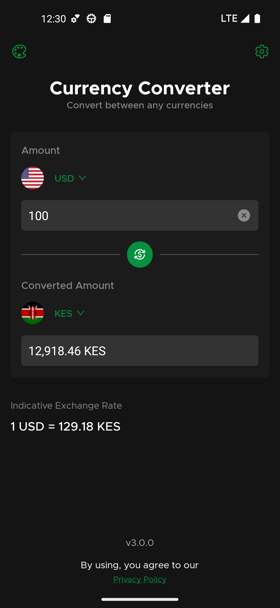
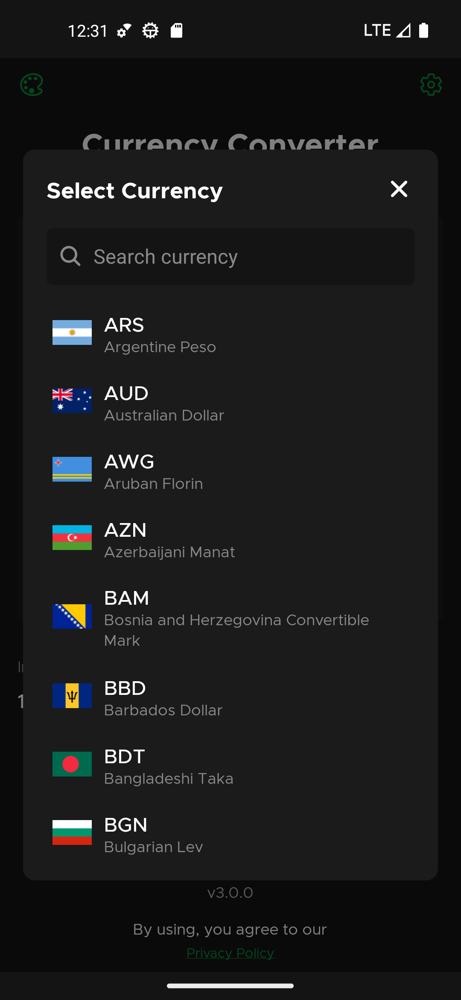
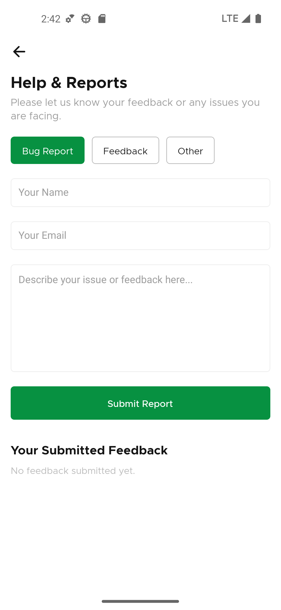

# Currency Converter

A modern currency converter application built with React Native and Expo, featuring real-time exchange rates, offline functionality, and a beautiful user interface. Convert between any currencies with ease, even without an internet connection.

## Features

- **Real-time Exchange Rates**: Get the latest exchange rates from the ExchangeRate-API
- **Offline Support**:
  - Background task updates every 15 minutes
  - Cached exchange rates and currency data
  - Full functionality without internet connection
- **Smart Currency Management**:
  - Automatic rate updates
  - Currency data caching for 3 days
  - Last used currencies remembered
  - Intelligent currency flag display system
- **User Experience**:
  - Dark/Light theme support
  - Responsive design for all screen sizes
  - Quick currency swap functionality
  - Searchable currency list with flags
  - History tracking of currency conversions
  - Beautiful flag display with proper scaling
  - Custom Okra font family for enhanced typography
- **Performance**:
  - Fast MMKV storage for offline data
  - Efficient currency data caching
  - New React Native Architecture enabled

## Screenshots

| Home Screen (Light)                              | Home Screen (Dark)                             | Currency Modal                                           |
| ------------------------------------------------ | ---------------------------------------------- | -------------------------------------------------------- |
|  |  |  |
| Conversion History                               | Help Screen                                    |                                                          |
|        |     |                                                          |

## Tech Stack

### Frontend

- **React Native** with **Expo** (v53.0.9)
- **TypeScript** - Type-safe JavaScript
- **React Native Screens** - Native navigation container
- **React Native Safe Area Context** - Safe area handling
- **React Native MMKV** - Fast key-value storage for offline data
- **Expo Updates** - Over-the-air updates
- **Expo Background Task** - Background data updates
- **Expo Task Manager** - Background task management
- **React Native Country Flag** - Currency flag display
- **React Native Keyboard Aware Scroll View** - Keyboard handling
- **Expo Build Properties** - Enhanced build configuration
- **Expo Vector Icons** - Icon system
- **Expo Font** - Custom font loading
- **Expo Splash Screen** - Splash screen management
- **Expo Constants** - App constants and configuration
- **Expo Application** - App information and utilities

### Development Tools

- **TypeScript** - Static type checking
- **EAS** - Expo Application Services for builds
- **Bun** - Fast JavaScript runtime and package manager
- **Jest** - Testing framework
- **Source Map Explorer** - Bundle analysis

## Getting Started

### Prerequisites

- Node.js
- Bun package manager (recommended) or npm
- Expo CLI
- EAS CLI (for builds and updates)

### Installation

1. Clone the repository

   ```bash
   git clone <repository-url>
   cd currency_converter
   ```

2. Install dependencies

   ```bash
   bun install
   ```

3. Set up environment variables

   ```bash
   # Create a .env.local file with your API keys
   EXPO_PUBLIC_RATES_API_URL=your_exchange_rate_api_key
   ```

4. Start the development server
   ```bash
   bunx expo start
   ```

## Available Scripts

- `bun run start` - Start the Expo development server
- `bun run android` - Run on Android device/emulator
- `bun run ios` - Run on iOS simulator
- `bun run build:android` - Build Android preview version
- `bun run build:web` - Build web version
- `bun run publish:expo` - Publish OTA updates
- `bun run release:web` - Deploy web version
- `bun run release:android` - Build Android release version
- `bun run release:ios` - Build iOS release version
- `bun run test` - Run tests
- `bun run lint` - Run linting
- `bun run format` - Format code
- `bun run analyze:web` - Analyze web bundle
- `bun run analyze:ios` - Analyze iOS bundle
- `bun run analyze:android` - Analyze Android bundle

## Environment Configuration

The app supports three environments:

- **Development**: Development builds with debug features
- **Preview**: Pre-release builds for testing
- **Production**: Production builds for app stores

Each environment has its own:

- Bundle identifier
- Package name
- App icon
- URL scheme

## Offline Functionality

The app provides full offline support through:

- **Background Task**: Updates exchange rates every 15 minutes
- **Data Caching**:
  - Exchange rates cached for 3 days
  - Currency list stored locally
  - Last used currencies and amounts remembered
- **MMKV Storage**: Fast and secure local storage
- **Error Handling**: Graceful fallback to cached data

## Development

The project uses modern development practices:

- TypeScript for type safety
- Jest for testing
- EAS for builds and updates
- New React Native Architecture
- EAS Build Cache Provider for faster builds

## Currency Handling

The app provides sophisticated currency handling:

- **Flag System**:
  - Automatic flag generation from currency codes
  - Support for special currency codes (crypto, etc.)
  - Proper flag scaling and display
  - Fallback handling for missing flags
- **Currency Selection**:
  - Quick currency swap functionality
  - Searchable currency list with flags
  - Last used currencies remembered
- **History Tracking**:
  - Conversion history with timestamps
  - Easy access to previous conversions
  - Automatic history cleanup

## License

[MIT License](LICENSE)
