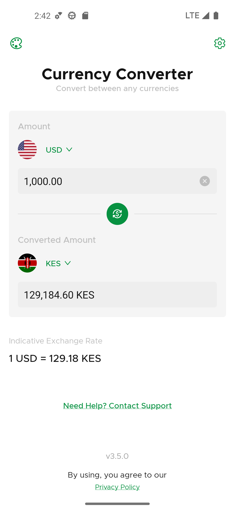
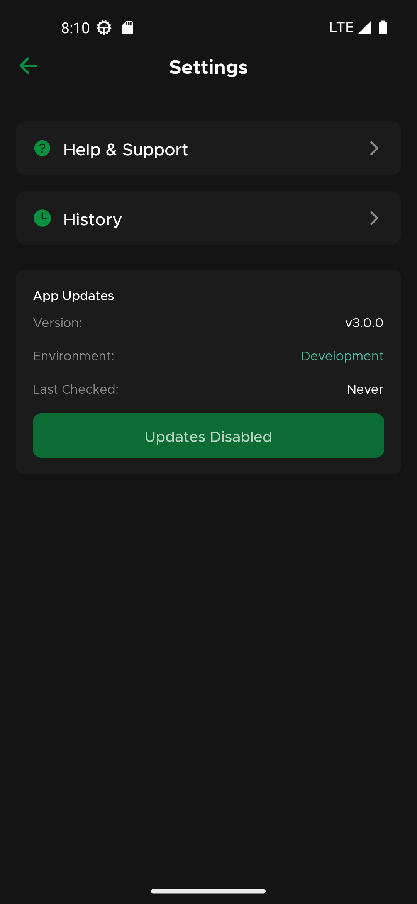
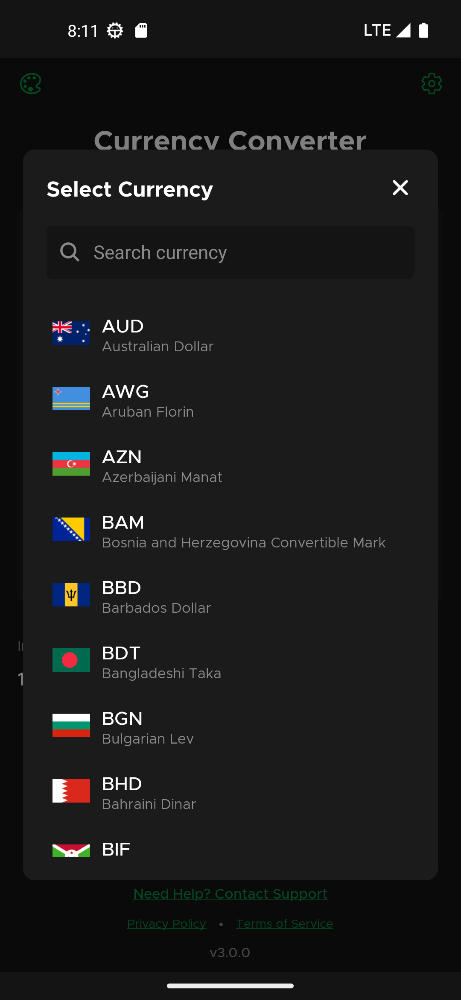
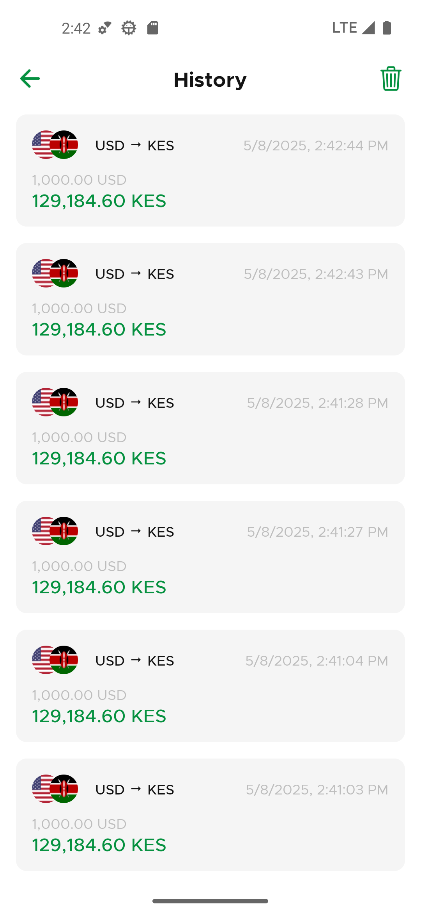
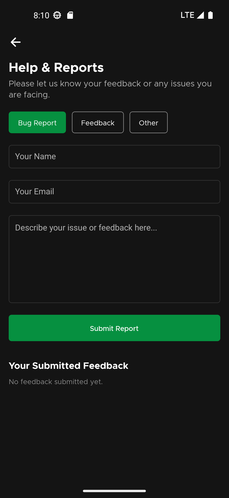

# Currency Converter

A modern currency converter application built with React Native, featuring real-time exchange rates, offline functionality, and a beautiful user interface. Convert between any currencies with ease, even without an internet connection.

## Features

- **Real-time Exchange Rates**: Get the latest exchange rates from the ExchangeRate-API
- **Offline Support**:
  - Background task updates every 15 minutes
  - Cached exchange rates and currency data
  - Full functionality without internet connection
- **Smart Currency Management**:
  - Automatic rate updates
  - Currency data caching for 3 days
  - Last used currencies remembered
  - Intelligent currency flag display system
- **User Experience**:
  - Dark/Light theme support with system preference detection
  - Responsive design for all screen sizes
  - Quick currency swap functionality
  - Searchable currency list with flags
  - History tracking of currency conversions
  - Beautiful flag display with proper scaling
  - Custom Okra font family for enhanced typography
- **Over-the-Air Updates**:
  - Automatic update checks
  - Version comparison and display
  - Update history tracking
  - Development mode detection
  - User-friendly update notifications
- **Performance**:
  - Fast MMKV storage for offline data
  - Efficient currency data caching
  - New React Native Architecture enabled

## Screenshots

| Home Screen (Light)                              | Settings Screen                              | Currency Modal                         |
| ------------------------------------------------ | -------------------------------------------- | -------------------------------------- |
|  |  |  |
| Conversion History                               | Help Screen                                  |                                        |
|        |          |                                        |

## Tech Stack

### Frontend

- **React Native** (v0.79.2)
- **TypeScript** - Type-safe JavaScript
- **React Native Screens** - Native navigation container
- **React Native Safe Area Context** - Safe area handling
- **React Native MMKV** - Fast key-value storage for offline data
- **React Native Country Flag** - Currency flag display
- **React Native Keyboard Aware Scroll View** - Keyboard handling
- **React Native Web** - Web platform support

### Selected Expo Packages

- **Expo Updates** - Over-the-air updates with version tracking
- **Expo Background Task** - Background data updates
- **Expo Task Manager** - Background task management
- **Expo Font** - Custom font loading
- **Expo Splash Screen** - Splash screen management
- **Expo Constants** - App constants and configuration
- **Expo Application** - App information and utilities
- **Expo Appearance** - System theme detection

### Development Tools

- **TypeScript** - Static type checking
- **EAS** - Expo Application Services for builds
- **Bun** - Fast JavaScript runtime and package manager
- **Jest** - Testing framework
- **Source Map Explorer** - Bundle analysis

## Getting Started

### Prerequisites

- Node.js
- Bun package manager (recommended) or npm
- Android Studio (for Android development)
- Xcode (for iOS development, macOS only)
- CocoaPods (for iOS development, macOS only)

### Installation

1. Clone the repository

   ```bash
   git clone <repository-url>
   cd currency_converter
   ```

2. Install dependencies

   ```bash
   bun install
   ```

3. Set up environment variables

   ```bash
   # Create a .env.local file with your API keys
   EXPO_PUBLIC_RATES_API_URL=your_exchange_rate_api_key
   ```

4. Install iOS dependencies (macOS only)

   ```bash
   cd ios && pod install && cd ..
   ```

5. Start the development server
   ```bash
   bunx expo start
   ```

## Available Scripts

- `bun run start` - Start the development server
- `bun run android` - Run on Android device/emulator
- `bun run ios` - Run on iOS simulator
- `bun run build:android` - Build Android preview version
- `bun run build:web` - Build web version
- `bun run publish:preview` - Publish OTA updates to preview channel
- `bun run release:web` - Deploy web version
- `bun run release:android` - Build Android release version
- `bun run release:ios` - Build iOS release version
- `bun run test` - Run tests
- `bun run format` - Format code
- `bun run analyze:web` - Analyze web bundle
- `bun run analyze:ios` - Analyze iOS bundle
- `bun run analyze:android` - Analyze Android bundle

## Environment Configuration

The app supports two environments:

- **Development**: Development builds with debug features
- **Preview**: Pre-release builds for testing and OTA updates

Each environment has its own:

- Bundle identifier
- Package name
- App icon
- URL scheme
- Update channel

## Update System

The app includes a sophisticated update system:

- **Automatic Updates**:
  - Background update checks
  - Version comparison
  - Update notifications
  - Last checked time tracking
- **Update Channels**:
  - Preview channel for testing
  - Development mode detection
  - Update history storage
- **User Interface**:
  - Clear version display
  - Update status indicators
  - Last checked time display
  - Update progress tracking

## Theme System

The app features a comprehensive theme system:

- **Theme Support**:
  - Light and dark themes
  - System preference detection
  - Manual theme override
  - Smooth theme transitions
- **Theme Context**:
  - Centralized theme management
  - Type-safe theme values
  - Consistent color palette
  - Dynamic theme switching

## Offline Functionality

The app provides full offline support through:

- **Background Task**: Updates exchange rates every 15 minutes
- **Data Caching**:
  - Exchange rates cached for 3 days
  - Currency list stored locally
  - Last used currencies and amounts remembered
- **MMKV Storage**: Fast and secure local storage
- **Error Handling**: Graceful fallback to cached data

## Development

The project uses modern development practices:

- TypeScript for type safety
- Jest for testing
- EAS for builds and updates
- New React Native Architecture
- EAS Build Cache Provider for faster builds

## Currency Handling

The app provides sophisticated currency handling:

- **Flag System**:
  - Automatic flag generation from currency codes
  - Support for special currency codes (crypto, etc.)
  - Proper flag scaling and display
  - Fallback handling for missing flags
- **Currency Selection**:
  - Quick currency swap functionality
  - Searchable currency list with flags
  - Last used currencies remembered
- **History Tracking**:
  - Conversion history with timestamps
  - Easy access to previous conversions
  - Automatic history cleanup

## License

[MIT License](LICENSE)
